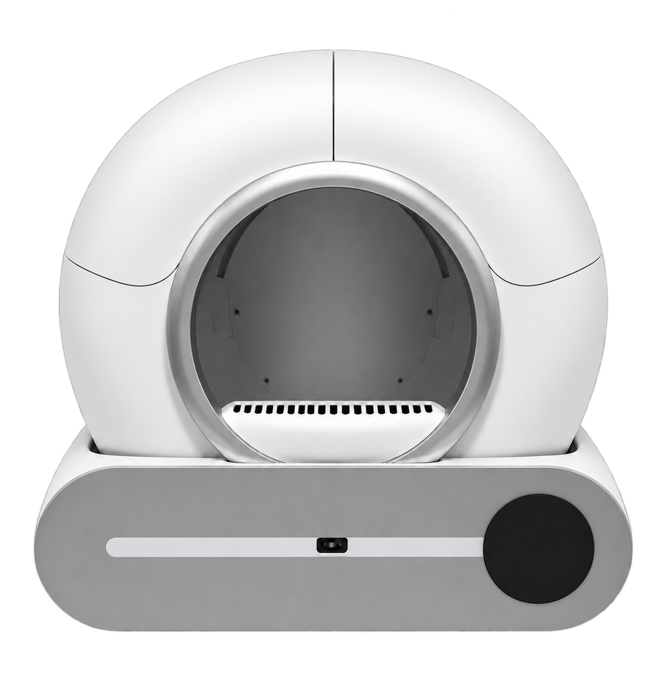

# 🐱 Litter-Card

[](https://github.com/hacs/default)
[](https://github.com/Rimfire03/Litter-card/releases)
[](https://opensource.org/licenses/MIT)

> A modern, elegant, and modular Lovelace card for generic automatic cat litter boxes in **Home Assistant**, ready for **HACS**.  
> *Une carte Lovelace moderne, épurée et modulaire pour les bacs à litière automatiques sous **Home Assistant**, prête pour **HACS**.*

---

## 🌐 Languages Supported / Langues Disponibles

- 🇬🇧 **English** (Default fallback)
- 🇫🇷 **Français**
- 🇩🇪 **Deutsch**
- 🇪🇸 **Español**

*The card automatically detects your Home Assistant language. You can also enforce it with `language: en | fr | de | es` in your card configuration.*

---



---

# 🇬🇧 English Documentation

## ✨ Features

- **Interactive Dynamic Visual**:
  - Embedded clean vector/image representation of the automatic litter box.
  - **Entrance Halo & Indicator**: Illuminates in **Green** with pulsating glow when the cat is inside (`occupancy = on`) and in **Red** when clear/idle.
  - **Cat Weight Display**: Live weight value dynamically overlaid in the bottom circular dial.
  - **Waste Bin Status Alert**: Animated badge in the top right corner when the bag is full.
- **Quick Statistics Overview**: Cleanings count, total visit counter, and duration of the last visit.
- **Manual Control Action Buttons**: Clean, Level litter, Replace bag, Bag changed confirmation, and Restart device.
- **Collapsible Settings & Configuration Accordion**:
  - Auto clean toggle (Switch)
  - Deep clean toggle (Switch)
  - Odor removal after cleaning (Switch)
  - Child lock (Lock / Switch)
  - Delay before cleaning (Slider in minutes)
  - Cleaning interval (Slider in minutes)
  - Full bin alert calibration (Slider in cycles)
  - Litter type selection (Dropdown)
  - Mass unit selection (Dropdown kg / lb)
- **100% Modular**: Any entity not defined in your card configuration will automatically be hidden from view.
- **Visual UI Card Editor**: Full integration with the Home Assistant dashboard editor with auto-detection of entities.

---

## 📦 Installation

### Method 1: Via HACS (Recommended)

1. Open **Home Assistant** and navigate to **HACS** > **Frontend**.
2. Click the **3 vertical dots menu** in the top right corner and choose **Custom repositories**.
3. Fill in the repository information:
   - **Repository**: `https://github.com/Rimfire03/Litter-card`
   - **Category**: `Lovelace` (or `Dashboard`)
4. Click **Add**.
5. Find **Litter Card** in your HACS list and click **Download**.
6. Refresh your browser when prompted.

---

### Method 2: Manual Installation

1. Download the `dist/litter-card.js` file from this repository.
2. Place `litter-card.js` into your Home Assistant directory: `config/www/litter-card.js`.
3. In Home Assistant, go to **Settings** > **Dashboards** > **Resources** (top right 3-dots menu).
4. Click **Add Resource**:
   - **URL**: `/local/litter-card.js`
   - **Resource type**: `JavaScript Module`
5. Save and reload your dashboard.

---

## 🛠️ Configuration Example (YAML)

```yaml
type: custom:litter-card
title: "Cat Litter Box"
# language: en # (Optional: en, fr, de, es - defaults to Home Assistant language)

# Action Buttons
btn_clean: button.cat_litter_box_clean
btn_level: button.cat_litter_box_level_litter
btn_restart: button.cat_litter_box_device_restart
btn_bag_replace: button.cat_litter_box_bag_replace
btn_bag_changed: button.cat_litter_box_empty

# Sensors
sensor_occupancy: binary_sensor.cat_litter_box_occupation
sensor_cat_weight: sensor.cat_litter_box_cat_weight
sensor_bin_full: binary_sensor.cat_litter_box_bin_full
sensor_status: sensor.cat_litter_box_etat
sensor_cleanings_count: sensor.cat_litter_box_number_of_cleanings
sensor_total_visits: sensor.cat_litter_box_total_visits
sensor_visit_duration: sensor.cat_litter_box_visit_duration
sensor_problem: binary_sensor.cat_litter_box_probleme

# Configuration & Settings
cfg_auto_clean: switch.cat_litter_box_nettoyage_automatique
cfg_deep_clean: switch.cat_litter_box_deep_clean
cfg_odor_removal: switch.cat_litter_box_odor_removal_after_cleaning
cfg_child_lock: lock.cat_litter_box_securite_enfant
cfg_clean_wait_time: number.cat_litter_box_clean_wait_time
cfg_clean_interval: number.cat_litter_box_clean_interval
cfg_bin_calibration: number.cat_litter_box_bin_full_calibration
cfg_litter_type: select.cat_litter_box_litter_type
cfg_unit: select.cat_litter_box_unit
```

---

## ⚙️ Configuration Reference

| Option | Type | Description |
| :--- | :--- | :--- |
| `title` | String | Card header title (default localized) |
| `image` | String | *(Optional)* Custom image URL if you prefer not using the embedded illustration |
| `language` | String | *(Optional)* Force language (`en`, `fr`, `de`, `es`) |
| `btn_clean` | Button entity | Triggers cleaning cycle |
| `btn_level` | Button entity | Levels and smooths litter bed |
| `btn_restart` | Button entity | Restarts the device |
| `btn_bag_replace` | Button entity | Moves drum to bag replacement position |
| `btn_bag_changed` | Button entity | Confirms bag replacement |
| `sensor_occupancy` | Binary sensor | Entrance halo indicator (**Green** when occupied, **Red** when clear) |
| `sensor_cat_weight` | Sensor | Cat weight value displayed in the lower circular gauge |
| `sensor_bin_full` | Binary sensor | Waste bin alert overlay |
| `sensor_status` | Sensor | Global status badge (*Standby, Cleaning, Sleep...*) |
| `sensor_cleanings_count` | Sensor | Cleanings counter tile |
| `sensor_total_visits` | Sensor | Total visits counter tile |
| `sensor_visit_duration` | Sensor | Last visit duration tile |
| `cfg_auto_clean` | Switch entity | Auto-clean switch toggle |
| `cfg_deep_clean` | Switch entity | Deep clean switch toggle |
| `cfg_odor_removal` | Switch entity | Odor removal post-clean switch toggle |
| `cfg_child_lock` | Lock / Switch | Child lock toggle |
| `cfg_clean_wait_time` | Number entity | Delay before cleaning (minutes) |
| `cfg_clean_interval` | Number entity | Cleaning interval (minutes) |
| `cfg_bin_calibration` | Number entity | Full bin calibration threshold (cycles) |
| `cfg_litter_type` | Select entity | Litter type selector (e.g. Mineral, Mixed) |
| `cfg_unit` | Select entity | Weight unit selector (kg / lb) |

---

<br>

# 🇫🇷 Documentation en Français

## ✨ Fonctionnalités

- **Rendu Visuel Interactif & Réactif** :
  - Silhouette intégrée de la machine automatique.
  - **Aura & témoin d'entrée** : s'illumine en **Vert** pulsant lorsque le chat est présent (`occupation = on`) et en **Rouge** en veille.
  - **Affichage du Poids du Chat** : valeur en temps réel intégrée directement dans le rond noir inférieur.
  - **Alerte Sac Plein** : badge dynamique et animé en haut à droite de l'image.
- **Statistiques en un coup d'œil** : Nombre de nettoyages, nombre total de visites et durée du passage.
- **Boutons de Contrôle Manuel** : Nettoyer, Niveler, Remplacement du sac, Sac changé, Redémarrer.
- **Menu Déroulant Paramètres & Configuration** :
  - Nettoyage automatique (Interrupteur)
  - Nettoyage intensif (Interrupteur)
  - Désodorisation après cycle (Interrupteur)
  - Sécurité enfants (Verrou / Interrupteur)
  - Délai avant nettoyage (Curseur en minutes)
  - Intervalle de nettoyage (Curseur en minutes)
  - Calibration du sac plein (Curseur en cycles)
  - Type de litière (Sélecteur Minérale / Mixte)
  - Unité de mesure (Sélecteur kg / lb)
- **100% Modulaire** : Toute entité non configurée sera automatiquement masquée du tableau de bord.
- **Éditeur Graphique Lovelace Intégré** : Configuration visuelle facile depuis l'interface Home Assistant.

---

## 📦 Installation

### Méthode 1 : Via HACS (Recommandé)

1. Ouvrez **Home Assistant** et allez dans **HACS** > **Interface utilisateur (Frontend)**.
2. Cliquez sur les **3 petits points** en haut à droite, puis sélectionnez **Dépôts personnalisés** (*Custom repositories*).
3. Entrez l'URL de votre dépôt :
   - **Dépôt** : `https://github.com/Rimfire03/Litter-card`
   - **Catégorie** : `Lovelace` (ou `Dashboard`)
4. Cliquez sur **Ajouter**.
5. Cherchez ensuite **Litter Card** dans la liste HACS et cliquez sur **Télécharger**.
6. Rechargez la page de votre navigateur.

---

### Méthode 2 : Installation Manuelle

1. Téléchargez le fichier `dist/litter-card.js`.
2. Déposez `litter-card.js` dans le dossier `config/www/` de votre Home Assistant.
3. Dans Home Assistant, rendez-vous dans **Paramètres** > **Tableaux de bord** > **Ressources** (menu 3 points en haut à droite).
4. Cliquez sur **Ajouter une ressource** :
   - **URL** : `/local/litter-card.js`
   - **Type de ressource** : `Module JavaScript`
5. Enregistrez et rafraîchissez votre tableau de bord.

---

## 🛠️ Exemple de Configuration YAML

```yaml
type: custom:litter-card
title: "Litière Chat"
# language: fr # (Optionnel: fr, en, de, es - détection auto par défaut)

# Boutons d'action
btn_clean: button.cat_litter_box_clean
btn_level: button.cat_litter_box_level_litter
btn_restart: button.cat_litter_box_device_restart
btn_bag_replace: button.cat_litter_box_bag_replace
btn_bag_changed: button.cat_litter_box_empty

# Capteurs
sensor_occupancy: binary_sensor.cat_litter_box_occupation
sensor_cat_weight: sensor.cat_litter_box_cat_weight
sensor_bin_full: binary_sensor.cat_litter_box_bin_full
sensor_status: sensor.cat_litter_box_etat
sensor_cleanings_count: sensor.cat_litter_box_number_of_cleanings
sensor_total_visits: sensor.cat_litter_box_total_visits
sensor_visit_duration: sensor.cat_litter_box_visit_duration
sensor_problem: binary_sensor.cat_litter_box_probleme

# Configuration & Réglages
cfg_auto_clean: switch.cat_litter_box_nettoyage_automatique
cfg_deep_clean: switch.cat_litter_box_deep_clean
cfg_odor_removal: switch.cat_litter_box_odor_removal_after_cleaning
cfg_child_lock: lock.cat_litter_box_securite_enfant
cfg_clean_wait_time: number.cat_litter_box_clean_wait_time
cfg_clean_interval: number.cat_litter_box_clean_interval
cfg_bin_calibration: number.cat_litter_box_bin_full_calibration
cfg_litter_type: select.cat_litter_box_litter_type
cfg_unit: select.cat_litter_box_unit
```

---

## 📄 Licence

Projet open-source sous licence [MIT](LICENSE) - Développé pour la communauté Home Assistant par [Rimfire03](https://github.com/Rimfire03).
