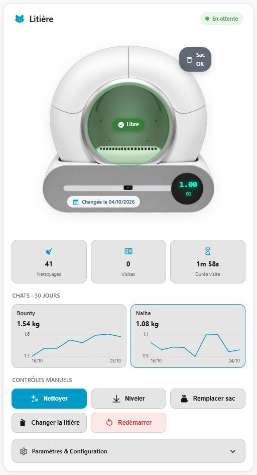

# 🐱 Litter-Card

[](https://github.com/hacs/default)
[](https://github.com/Rimfire03/Litter-card/releases)
[](https://opensource.org/licenses/MIT)
[](https://buymeacoffee.com/slide598b)

> A modern, elegant, and modular Lovelace card for generic automatic cat litter boxes in **Home Assistant**, ready for **HACS**.  
> *Une carte Lovelace moderne, épurée et modulaire pour les bacs à litière automatiques sous **Home Assistant**, prête pour **HACS**.*

---

## ☕ Support / Soutenir le projet

If you find this card helpful, consider buying me a coffee to support the development!  
*Si vous appréciez cette carte, vous pouvez m'offrir un café pour soutenir le développement !*

<a href="https://buymeacoffee.com/slide598b" target="_blank"></a>

---

## 🌐 Languages Supported / Langues Disponibles

- 🇬🇧 **English** (Default fallback)
- 🇫🇷 **Français**
- 🇩🇪 **Deutsch**
- 🇪🇸 **Español**

*The card automatically detects your Home Assistant language. You can also enforce it with `language: en | fr | de | es` in your card configuration.*

---



---

# 🇬🇧 English Documentation

## ✨ Features

- **Interactive Dynamic Visual**:
  - Embedded clean vector/image representation of the automatic litter box.
  - **Entrance Halo & Indicator**: glows **green** when the litter box is free and **red** with a pulsing glow when a cat is inside (`occupancy = on`). It turns **grey** ("Litter box offline") when the status sensor is `unavailable`.
  - **Cat Weight Display**: Live weight value dynamically overlaid in the bottom circular dial.
  - **Waste Bin Status Alert**: Animated badge in the top right corner when the bag is full.
- **Quick Statistics Overview**: Cleanings count, total visit counter, and duration of the last visit.
- **Manual Control Action Buttons**: Clean, Level litter, Replace bag, Change litter ("Bag changed"), and Restart device.
- **Status-aware effects**: the Clean, Level and Change litter buttons glow while the device is cleaning, leveling or emptying. When the bag is full, the status badge turns orange and blinks, and so does the Replace bag button. When the status is `unavailable`, the card shows the device as offline (grey halo, red status, no bag badge). Status values are recognised in English and in French (for example `cleaning` / `Nettoyage`, `smoothing` / `Lissage`, `emptying` / `Vidange`, `full` / `Plein`).
- **Per-cat weight tracking** (set the number of cats and their names):
  - Each weigh-in of the weight sensor is assigned to a cat: by grouping the weights (names go from the lightest to the heaviest), or, if you give a reference weight for every cat (a decimal number with a dot, in the sensor's unit, for example `4.2`), to the nearest reference.
  - The references adjust automatically as the cats' weight changes, and a weigh-in too far from every reference (a visitor) is ignored. Cats whose weights are closer than 0.4 can be mixed up.
  - Each cat gets its recent weight and a graph over the period you choose (7 to 180 days, 30 by default), with axes (weights and dates) that you can hide.
  - The history is rebuilt from the sensor's recorded history and kept by the card.
- **Last litter change date**: shown on the image and recorded by the card each time the "Bag changed" button is pressed (stored per Home Assistant user, with browser storage as fallback).
- **Collapsible Settings & Configuration Accordion**:
  - Auto clean toggle (Switch)
  - Deep clean toggle (Switch)
  - Odor removal after cleaning (Switch)
  - Child lock (Lock / Switch)
  - Delay before cleaning (Slider in minutes)
  - Cleaning interval (Slider in minutes)
  - Full bin alert calibration (Slider in cycles)
  - Litter type selection (Dropdown)
  - Mass unit selection (Dropdown kg / lb)
- **100% Modular**: Any entity not defined in your card configuration will automatically be hidden from view.
- **Visual UI Card Editor**: Full integration with the Home Assistant dashboard editor with auto-detection of entities.

---

## 📦 Installation

### Method 1: Via HACS (Recommended)

1. Open **Home Assistant** and navigate to **HACS** > **Frontend**.
2. Search for **Litter Card** and click **Download**.
3. Refresh your browser when prompted.

---

### Method 2: Manual Installation

1. Download the `dist/litter-card.js` file from this repository.
2. Place `litter-card.js` into your Home Assistant directory: `config/www/litter-card.js`.
3. In Home Assistant, go to **Settings** > **Dashboards** > **Resources** (top right 3-dots menu).
4. Click **Add Resource**:
   - **URL**: `/local/litter-card.js`
   - **Resource type**: `JavaScript Module`
5. Save and reload your dashboard.

---

## 🛠️ Configuration Example (YAML)

```yaml
type: custom:litter-card
title: "Cat Litter Box"
# language: en # (Optional: en, fr, de, es - defaults to Home Assistant language)

# Action Buttons
btn_clean: button.cat_litter_box_clean
btn_level: button.cat_litter_box_level_litter
btn_restart: button.cat_litter_box_device_restart
btn_bag_replace: button.cat_litter_box_bag_replace
btn_bag_changed: button.cat_litter_box_empty

# Sensors
sensor_occupancy: binary_sensor.cat_litter_box_occupation
sensor_cat_weight: sensor.cat_litter_box_cat_weight
sensor_bin_full: binary_sensor.cat_litter_box_bin_full
sensor_status: sensor.cat_litter_box_etat
sensor_cleanings_count: sensor.cat_litter_box_number_of_cleanings
sensor_total_visits: sensor.cat_litter_box_total_visits
sensor_visit_duration: sensor.cat_litter_box_visit_duration
sensor_problem: binary_sensor.cat_litter_box_probleme

# Configuration & Settings
cfg_auto_clean: switch.cat_litter_box_nettoyage_automatique
cfg_deep_clean: switch.cat_litter_box_deep_clean
cfg_odor_removal: switch.cat_litter_box_odor_removal_after_cleaning
cfg_child_lock: lock.cat_litter_box_securite_enfant
cfg_clean_wait_time: number.cat_litter_box_clean_wait_time
cfg_clean_interval: number.cat_litter_box_clean_interval
cfg_bin_calibration: number.cat_litter_box_bin_full_calibration
cfg_litter_type: select.cat_litter_box_litter_type
cfg_unit: select.cat_litter_box_unit
```

---

## ⚙️ Configuration Reference

| Option | Type | Description |
| :--- | :--- | :--- |
| `title` | String | Card header title (default localized) |
| `model` | String | Model preset (`doel_ti_pro_25`, `generic`) - auto-configures image & overlay coordinates |
| `image` | String | *(Optional)* Custom image URL if you prefer not using the embedded illustration |
| `language` | String | *(Optional)* Force language (`en`, `fr`, `de`, `es`) |
| `btn_clean` | Button entity | Triggers cleaning cycle |
| `btn_level` | Button entity | Levels and smooths litter bed |
| `btn_restart` | Button entity | Restarts the device |
| `btn_bag_replace` | Button entity | Moves drum to bag replacement position |
| `btn_bag_changed` | Button entity | Confirms bag replacement |
| `sensor_occupancy` | Binary sensor | Entrance halo indicator (**Green** when occupied, **Red** when clear) |
| `sensor_cat_weight` | Sensor | Cat weight value displayed in the lower circular gauge |
| `sensor_bin_full` | Binary sensor | Waste bin alert overlay |
| `sensor_status` | Sensor | Global status badge (*Standby, Cleaning, Sleep...*) |
| `sensor_cleanings_count` | Sensor | Cleanings counter tile |
| `sensor_total_visits` | Sensor | Total visits counter tile |
| `sensor_visit_duration` | Sensor | Last visit duration tile |
| `cfg_auto_clean` | Switch entity | Auto-clean switch toggle |
| `cfg_deep_clean` | Switch entity | Deep clean switch toggle |
| `cfg_odor_removal` | Switch entity | Odor removal post-clean switch toggle |
| `cfg_child_lock` | Lock / Switch | Child lock toggle |
| `cfg_clean_wait_time` | Number entity | Delay before cleaning (minutes) |
| `cfg_clean_interval` | Number entity | Cleaning interval (minutes) |
| `cfg_bin_calibration` | Number entity | Full bin calibration threshold (cycles) |
| `cfg_litter_type` | Select entity | Litter type selector (e.g. Mineral, Mixed) |
| `cfg_unit` | Select entity | Weight unit selector (kg / lb) |
| `entrance_pos_x` | Number (%) | Custom X position of the entrance halo (default: 50) |
| `entrance_pos_y` | Number (%) | Custom Y position of the entrance halo (default: 41.5) |
| `entrance_width` | Number (%) | Custom width of the entrance halo (default: 48) |
| `entrance_height` | Number (%) | Custom height of the entrance halo (default: 31) |
| `entrance_shape` | String | Shape of the entrance halo (`circle`, `ellipse`, `rounded`, `square`) |
| `weight_pos_x` | Number (%) | Custom X position of the weight overlay (default: 83.1) |
| `weight_pos_y` | Number (%) | Custom Y position of the weight overlay (default: 77.8) |
| `weight_size` | Number (rem) | Font size for cat weight text (default: 1.15) |
| `bin_pos_x` | Number (%) | Custom X position of the waste bin alert (default: 85) |
| `bin_pos_y` | Number (%) | Custom Y position of the waste bin alert (default: 14) |
| `bin_scale` | Number | Scale multiplier for waste bin alert (default: 1) |
| `litter_date_pos_x` | Number (%) | Custom X position of the litter change date (default: 37) |
| `litter_date_pos_y` | Number (%) | Custom Y position of the litter change date (default: 85) |
| `cat_count` | Number (1-6) | Number of cats in the house. Enables per-cat weight tracking (needs `sensor_cat_weight`) |
| `cat_history_days` | Number | Period of the weight history graph and of the history fetched from the sensor, in days: `7`, `14`, `30` (default), `90` or `180`. It cannot go further back than what Home Assistant keeps for the sensor (10 days by default) or than what the card has already recorded |
| `cat_show_axes` | String | `on` (default) shows the axes of each cat's weight graph (highest and lowest weight on the left, first and last date below, dotted guide lines); `off` shows the bare curve |
| `cat_name_1` ... `cat_name_6` | String | Name of each cat (from the lightest to the heaviest when no reference weights are set) |
| `cat_weight_1` ... `cat_weight_6` | Number | Reference weight of each cat: a decimal number with a dot, in the unit of the weight sensor (for example `4.2`). When set for every cat, each weigh-in goes to the nearest reference, whatever the order of the names. The references then follow the cats' weight over time on their own; a weigh-in too far from every reference (a visitor) is ignored |

---

<br>

# 🇫🇷 Documentation en Français

## ✨ Fonctionnalités

- **Rendu Visuel Interactif & Réactif** :
  - Silhouette intégrée de la machine automatique.
  - **Aura & témoin d'entrée** : s'illumine en **vert** quand le bac est libre et en **rouge** pulsant quand un chat est présent (`occupation = on`). Elle devient **grise** (« Litière hors ligne ») quand le capteur d'état est `unavailable`.
  - **Affichage du Poids du Chat** : valeur en temps réel intégrée directement dans le rond noir inférieur.
  - **Alerte Sac Plein** : badge dynamique et animé en haut à droite de l'image.
- **Statistiques en un coup d'œil** : Nombre de nettoyages, nombre total de visites et durée du passage.
- **Boutons de Contrôle Manuel** : Nettoyer, Niveler, Remplacer sac, Changer la litière, Redémarrer.
- **Effets selon l'état** : les boutons Nettoyer, Niveler et Changer la litière s'illuminent pendant le nettoyage, le lissage ou la vidange. Quand le sac est plein, le badge d'état passe à l'orange et clignote, tout comme le bouton Remplacer sac. Quand l'état est `unavailable`, la carte affiche le bac comme hors ligne (aura grise, état en rouge, pas de badge de sac). Les états sont reconnus en anglais et en français (par exemple `cleaning` / `Nettoyage`, `smoothing` / `Lissage`, `emptying` / `Vidange`, `full` / `Plein`).
- **Suivi du poids par chat** (indiquez le nombre de chats et leurs noms) :
  - Chaque pesée du capteur de poids est attribuée à un chat : en regroupant les poids (noms donnés du plus léger au plus lourd), ou, si vous indiquez un poids de référence pour chaque chat (nombre décimal avec un point, dans l'unité du capteur, par exemple `4.2`), au chat dont la référence est la plus proche.
  - Les références s'ajustent automatiquement avec l'évolution du poids des chats, et une pesée trop éloignée de toutes les références (un visiteur) est ignorée. Des chats dont les poids sont à moins de 0,4 d'écart peuvent être confondus.
  - Chaque chat a son poids récent et un graphique sur la période choisie (de 7 à 180 jours, 30 par défaut), avec des axes (poids et dates) que vous pouvez masquer.
  - L'historique est reconstruit à partir de l'historique enregistré du capteur et conservé par la carte.
- **Date du dernier changement de litière** : affichée sur l'image et enregistrée par la carte à chaque appui sur « Changer la litière » (stockée par utilisateur Home Assistant, avec le navigateur en secours).
- **Menu Déroulant Paramètres & Configuration** :
  - Nettoyage automatique (Interrupteur)
  - Nettoyage intensif (Interrupteur)
  - Désodorisation après cycle (Interrupteur)
  - Sécurité enfants (Verrou / Interrupteur)
  - Délai avant nettoyage (Curseur en minutes)
  - Intervalle de nettoyage (Curseur en minutes)
  - Calibration du sac plein (Curseur en cycles)
  - Type de litière (Sélecteur Minérale / Mixte)
  - Unité de mesure (Sélecteur kg / lb)
- **100% Modulaire** : Toute entité non configurée sera automatiquement masquée du tableau de bord.
- **Éditeur Graphique Lovelace Intégré** : Configuration visuelle facile depuis l'interface Home Assistant.

---

## 📦 Installation

### Méthode 1 : Via HACS (Recommandé)

1. Ouvrez **Home Assistant** et allez dans **HACS** > **Interface utilisateur (Frontend)**.
2. Recherchez **Litter Card** et cliquez sur **Télécharger**.
3. Rechargez la page de votre navigateur.

---

### Méthode 2 : Installation Manuelle

1. Téléchargez le fichier `dist/litter-card.js`.
2. Déposez `litter-card.js` dans le dossier `config/www/` de votre Home Assistant.
3. Dans Home Assistant, rendez-vous dans **Paramètres** > **Tableaux de bord** > **Ressources** (menu 3 points en haut à droite).
4. Cliquez sur **Ajouter une ressource** :
   - **URL** : `/local/litter-card.js`
   - **Type de ressource** : `Module JavaScript`
5. Enregistrez et rafraîchissez votre tableau de bord.

---

## 🛠️ Exemple de Configuration YAML

```yaml
type: custom:litter-card
title: "Litière Chat"
# language: fr # (Optionnel: fr, en, de, es - détection auto par défaut)

# Boutons d'action
btn_clean: button.cat_litter_box_clean
btn_level: button.cat_litter_box_level_litter
btn_restart: button.cat_litter_box_device_restart
btn_bag_replace: button.cat_litter_box_bag_replace
btn_bag_changed: button.cat_litter_box_empty

# Capteurs
sensor_occupancy: binary_sensor.cat_litter_box_occupation
sensor_cat_weight: sensor.cat_litter_box_cat_weight
sensor_bin_full: binary_sensor.cat_litter_box_bin_full
sensor_status: sensor.cat_litter_box_etat
sensor_cleanings_count: sensor.cat_litter_box_number_of_cleanings
sensor_total_visits: sensor.cat_litter_box_total_visits
sensor_visit_duration: sensor.cat_litter_box_visit_duration
sensor_problem: binary_sensor.cat_litter_box_probleme

# Configuration & Réglages
cfg_auto_clean: switch.cat_litter_box_nettoyage_automatique
cfg_deep_clean: switch.cat_litter_box_deep_clean
cfg_odor_removal: switch.cat_litter_box_odor_removal_after_cleaning
cfg_child_lock: lock.cat_litter_box_securite_enfant
cfg_clean_wait_time: number.cat_litter_box_clean_wait_time
cfg_clean_interval: number.cat_litter_box_clean_interval
cfg_bin_calibration: number.cat_litter_box_bin_full_calibration
cfg_litter_type: select.cat_litter_box_litter_type
cfg_unit: select.cat_litter_box_unit
```

---

## 📄 Licence

Projet open-source sous licence [MIT](LICENSE) - Développé pour la communauté Home Assistant par [Rimfire03](https://github.com/Rimfire03).
